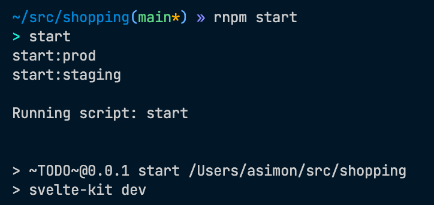

# RNPM

## What is this

This is a tiny wrapper around javascript package managers, in your project you can write `rnpm start` and it will list all the scripts that contain the word `start` like this:

Then you can select the script you want to run, hit `Enter` and it will figure it out if you're using `npm`, `yarn` or `pnpm` and run the script with the correct package manager.

If there's only one matching script it will run that immediately.

## Usage

USAGE:
rnpm [FLAGS] [OPTIONS] [script]

FLAGS:

- -h, --help Prints help information
- -r, --run-exact If set, immediately run the script that matches exactly.
- -V, --version Prints version information

OPTIONS

- -m, --manager <PACKAGE MANAGER> [possible values: npm, yarn, pnpm]

ARGS:

- \<script> The string you're searching for

Running `rnpm --help` gives you the same output as above.
